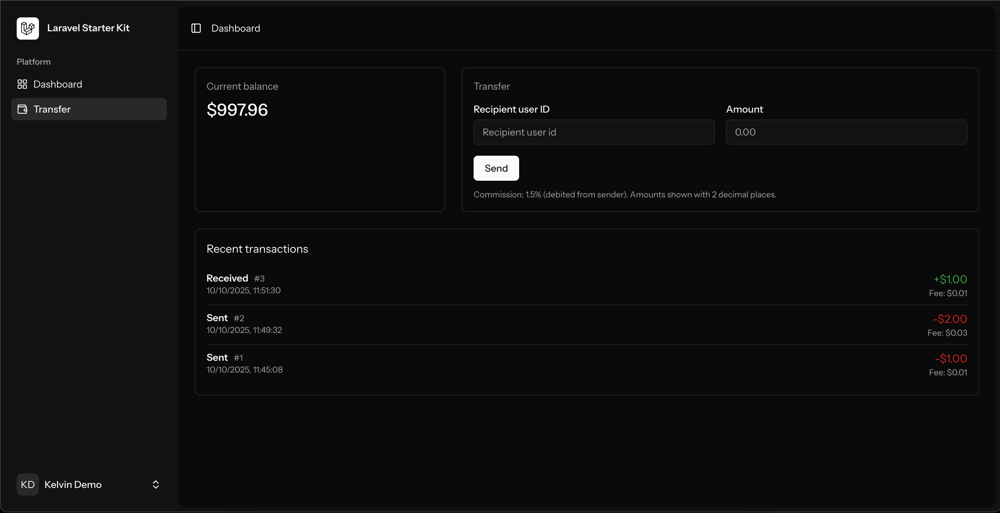

# Mini Wallet — High‑Performance Edition

This repository is a monolithic, production‑minded mini digital wallet built with Laravel (API) + Vue 3 (Inertia) designed for high concurrency and large datasets. It focuses on correctness, scalability and testability.

Key features

- Atomic, concurrency‑safe transfers (Postgres row locks + DB transactions).
- Commission calculation (1.5%) applied to the sender.
- Balances stored on `users.balance` for O(1) reads; full transaction ledger is persisted in `transactions`.
- Real‑time updates via Laravel broadcasting (Pusher / Echo) on private `user.{id}` channels.
- Test driven development: Pest / PHPUnit tests (unit, feature, concurrency and optional benchmarks).
- Frontend: Inertia + Vue 3 (Composition API) simple Transfer page that listens to real‑time events.
- Real-time form validation with `laravel‑precognition`.

Why these architecture choices

- Balance storage on users table: Reading a user's balance must be constant time even with millions of transactions. Persisting balance on the user row and maintaining a transaction ledger provides both fast reads and full auditability.
- Use DB transactions + SELECT ... FOR UPDATE (lockForUpdate): prevents race conditions and ensures updates are atomic across sender and receiver rows. Order locks by user id to avoid deadlocks.
- Decimal arithmetic with BCMath: use fixed precision arithmetic (2 decimal places in this implementation) to avoid floating point errors in financial calculations.
- Postgres as DB: robust transactional guarantees and row locking semantics required for correctness under high concurrency.
- Concurrency tests spawn independent PHP processes (Symfony Process + artisan command): Laravel test harness runs in a single process/DB connection and wrapped transactions hide real DB contention. Separate processes simulate true concurrent DB sessions, exercising lock contention and deadlock scenarios as they would appear in production.
- Broadcast via Laravel events / Echo: immediate UX updates for sender and receiver after commit. Tests use Event::fake() to avoid external network operations while asserting dispatch.

Quickstart (development)

1. copy env
    - cp .env.example .env
    - Fill DB*\*, BROADCAST_DRIVER, PUSHER*\* and APP_KEY (php artisan key:generate)
2. Install & build
    - composer install
    - npm install
    - npm run build (or npm run dev)
3. Migrate & seed
    - php artisan migrate
    - php artisan db:seed
    - The seed creates two demo users (Email / password):
        - Kelvin: kelvin@example.com / password
        - Tolu: tolu@example.com / password
4. Serve
    - php artisan serve
    - npm run dev

API

- GET /api/transactions
    - returns { data: { balance: "xx.xx", transactions: { data: [ ... ], links, meta } } }
    - paginated, capped per_page (default 20, max 100)
- POST /api/transactions
    - body: { receiver_id: integer, amount: decimal(2) }
    - server validates request, computes commission (1.5%), performs atomic transfer, creates ledger entry and broadcasts event.
    - response: 201 with transaction data on success; 422 on validation/insufficient funds.

Database notes

- users table includes `balance` decimal(18,2) (current implementation uses 2 dp).
- transactions table contains sender_id, receiver_id, amount, commission_fee, metadata, timestamps.
- Indexes on sender_id, receiver_id and created_at for efficient history queries.
- I'd consider using integer cents (bigint) for production to fully avoid decimal pitfalls — conversion helpers exist in the codebase.

Concurrency & testing strategy

- Fast tests: Pest configured to globally apply RefreshDatabase for unit/feature tests (transactional, fast).
- Concurrency tests: placed under `tests/Concurrency` and use DatabaseMigrations (no wrapping transaction). Each concurrent worker is an isolated PHP process (artisan command `app:create-transactions`) which uses the same testing DB via explicit environment propagation.
    - Why? RefreshDatabase opens a transaction in the test process — other DB sessions (child processes) won't see uncommitted data or schema; this hides real lock contention. Separate processes mimic real concurrent DB sessions and therefore reveal race conditions, deadlocks and integrity issues.
- Files:
    - tests/Feature/Transactions/Concurrency/CreateTransactionsConcurrentlyTest.php — multiple scenarios (many concurrent transfers, overdraft protections, many senders -> one receiver).
    - tests/Feature/... — correctness, validation, atomic rollback, scale checks and benchmarks (gated).
- Concurrency helpers:
    - spawnTransferProcess() — builds Symfony Process with `--env=testing` and DB env vars propagated.
    - transfer artisan command located at `app/Console/Commands/Transactions/CreateTransactions.php`.

Running tests

- Fast suite (default): composer test or ./vendor/bin/pest
- Concurrency tests:
    - Ensure a real testing DB (not in-memory sqlite) and .env.testing points to it.
    - ./vendor/bin/pest tests/Concurrency

Validation & security

- Request validation is centralized in `app/Http/Requests/Transactions/CreateTransactionsRequest.php`:
    - ensures receiver exists, prevents self-transfers, enforces amount format and minimum and optionally pre-checks balance for better UX (final check still server-side inside service).
- Authentication: project combines Laravel Auth and Sanctum (see resources and controllers). API endpoints use `auth:sanctum` middleware.
- Channel auth: `routes/channels.php` authorizes `user.{id}` private channels.

TransactionsService (core)

- Performs:
    - amount normalization (2dp)
    - commission = amount \* 0.015
    - totalDebit = amount + commission
    - DB::transaction wrapper
    - lock both users with lockForUpdate, ordered by id
    - balance checks via bccomp
    - update user balances and persist transaction ledger

Broadcasting

- Event: `App\Events\Transactions\TransactionCreated` implements ShouldBroadcastNow for immediate broadcast (no queues).
- Broadcast channels: `private-user.{id}` — frontend subscribes and updates balance + transactions list in real time.
- Configure broadcasting driver and Pusher credentials in .env for full end-to-end testing.

Frontend (Inertia + Vue 3)

- Transfer.vue: simple form to send funds, shows current balance and recent transactions, listens to Echo private `user.{id}` channel and updates UI on event.

Performance & scaling suggestions (next steps)

- Switch to storing monetary values as integer cents (bigint) for absolute safety and consistency.
- For extreme throughput (>hundreds/sec):
    - Add optimistic locking, rate limiting, and/or a lightweight command queue that batches balance updates to reduce contention.
    - Horizontally partition users across DB nodes or use a fast in-memory ledger (Redis) as a write buffer followed by durable worker reconciliation.
    - Consider eventual consistency for non-critical analytics while keeping strict consistency for balances.
- Add p95/p99 latency benchmarks in a controlled environment (dedicated DB + network conditions).

Troubleshooting notes

- "table not found" in concurrency tests: child processes must see the same DB and schema — don't use sqlite in-memory. Use DatabaseMigrations and pass DB env vars to child processes.
- Ensure .env.testing is configured correctly, and create the testing DB (mini_wallet_test) and credentials before running tests.
